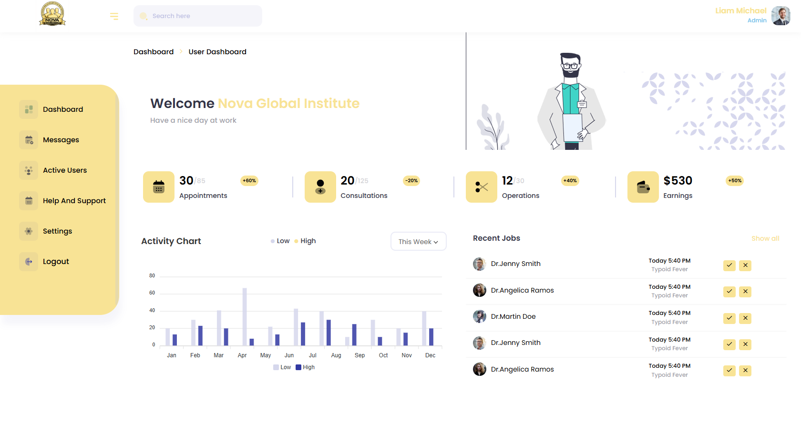

# Nova Global Institute - Dashboard

## Overview

**Nova Global Institute Dashboard** is a premium, responsive administrative platform designed for modern institutional management. It provides a centralized hub to monitor performance metrics, facilitate internal communications, and manage user data through a sleek, high-performance interface.



## Features

- **Responsive Design**: Fully optimized for seamless performance across Desktops (1440px+), Tablets, and Mobile devices (320px+).
- **Interactive Analytics**: Dynamic activity charts and statistics powered by ApexCharts for real-time data visualization.
- **Advanced Communication**: Integrated messaging system (Chat) with user status tracking and message management.
- **User Administration**: Comprehensive management of active users, profile filtering, and detailed user insights.
- **Customizable UI**: Robust set of form elements, including select2 integration, custom inputs, and validation states.
- **Modern Performance**: Fast-loading assets with optimized jQuery plugins and Bootstrap 5 framework.

## Technology Stack

- **Frontend**: HTML5, CSS3, JavaScript
- **Framework**: Bootstrap 5, jQuery 3.7.1
- **Charts & Data**: ApexCharts, jQuery DataTables
- **UI Libraries**: Select2, Feather Icons, Font Awesome 6, Slimscroll
- **Utilities**: Waypoints, CounterUp, Rocket Loader

## Project Structure

```
012-Nova-Global-Institute-Dashboard/
├── assets/                 # Core assets (CSS, JS, Images, Plugins)
│   ├── css/                # Custom and vendor stylesheets
│   ├── js/                 # Main application logic (app.js)
│   ├── img/                # UI icons, avatars, and logos
│   └── plugins/            # Third-party libraries (ApexCharts, DataTables, etc.)
├── index.html              # Main Dashboard Overview
├── chat.html               # Messaging & Communication Hub
├── patients.html           # Active Users / Registry Management
├── profile.html            # User Profile View
├── edit-profile.html       # Profile Editing Interface
├── settings.html           # System & Notification Settings
├── change-password.html    # Security Management
├── help.html               # Support & Documentation
└── README.md               # Project documentation
```

## Dashboard Modules

**Analytics**: Real-time monitoring of appointments, consultations, and earnings.

**Communication**: Professional chat interface with file sharing and active status support.

**Management**: Comprehensive user profiles, social link integration, and activity tracking.

**Security**: Role-based access simulation with account protection and password management.

## Installation

1. Download or clone the repository.
2. Ensure you have the `assets/` directory in the same root as the HTML files.
3. Open `index.html` in any modern web browser.
4. No server-side installation or database setup is required for the static preview.

## Features Overview

| Feature | Details |
|---------|---------|
| **Responsiveness** | Mobile-First approach, tested from 320px to 2560px |
| **Data Visualization** | Interactive charts (Area, Line, Donut) using ApexCharts |
| **Navigation** | Sidebar toggle, slimscroll integration, topbar search |
| **Forms** | Advanced input groups, Select2 dropdowns, profile editors |
| **Messaging** | Fully designed chat UI with responsive message bubbles |

## Contact

- 📞 **Phone**: 0319-2020749
- ✉️ **Email**: wasay45456@gmail.com

---
*Built for excellence in modern administrative management.*
