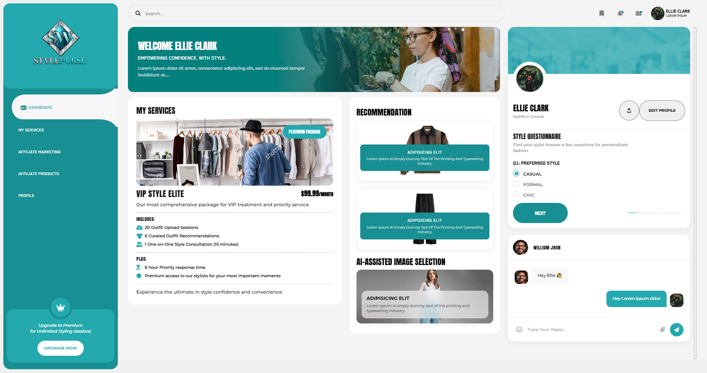

# Style Pulse - Personal Styling Dashboard

## Overview

**Style Pulse Dashboard** is a premium, responsive personal styling and fashion management platform. It empowers users to define their unique style through AI-assisted recommendations, interactive questionnaires, and personalized styling services, all within a sleek, modern interface.



## Features

- **Responsive Design**: Seamlessly optimized for mobile, tablet, and desktop devices using Bootstrap 5 and Slicknav.
- **AI-Assisted Selection**: Advanced image selection powered by AI to help users find the perfect look.
- **Interactive Questionnaire**: A tailored 5-step style assessment to build a comprehensive fashion profile.
- **Service Management**: Tiered membership packages (Basic and Gold) for professional styling guidance.
- **Affiliate Integration**: Built-in modules for affiliate marketing and product discovery.
- **Real-Time Communication**: Integrated chat system with support for emojis, image uploads, and document sharing.
- **Profile Personalization**: Comprehensive user profile management with instant image upload previews and date formatting.

## Technology Stack

- **Frontend**: HTML5, CSS3, JavaScript
- **Framework**: Bootstrap 5, jQuery 3.6.0
- **Sliders & Navigation**: Slick Slider, Slicknav
- **UI Libraries**: Font Awesome 6, Flatpickr, EmojiButton
- **Fonts**: Custom typography (Blender Pro)

## Project Structure

```
StylePulse/
├── css/                    # Custom and vendor stylesheets (custom.css, responsive.css)
├── js/                     # Main application logic (custom.js, topbar.js)
├── images/                 # Brand assets, logos, user avatars, and service images
├── layout/                 # Reusable HTML components (sidebar.html, topbar.html)
├── fonts/                  # Custom typography files
├── slick/                  # Slick Slider plugin assets
├── index.html              # Main Dashboard Entry
├── services.html           # Styling Services Overview
├── affiliate-marketing.html # Marketing Dashboard
├── affiliate-products.html  # Product Discovery Page
├── profile.html            # User Settings & Profile Management
└── README.md               # Project documentation
```

## Dashboard Modules

**Personal Styling**: Interactive questionnaires and AI-driven image analysis for tailored fashion advice.

**Community & Services**: Access to expert styling packages and community engagement tools.

**Affiliate HUB**: Streamlined interface for managing affiliate products and marketing activities.

**Communication**: Secure chat portal for direct interaction with stylists, featuring multi-format file support.

## Installation

1. Download or clone the repository.
2. Ensure the directory structure (css, js, images, layout, slick) is preserved in the root.
3. Open `index.html` in any modern web browser.
4. This is a frontend-ready dashboard; no complex server-side setup is required for the static preview.

## Features Overview

| Feature | Details |
|---------|---------|
| **Responsiveness** | Mobile-First approach with responsive navigation |
| **Styling Tools** | 5-Step questionnaire and AI-assisted selection |
| **Service Plans** | Basic and Gold package management |
| **Communication** | Advanced chat UI with file and emoji support |
| **Performance** | Optimized asset loading and modular layout system |

## Contact

- 📞 **Phone**: 0319-2020749
- ✉️ **Email**: wasay45456@gmail.com

---
*Empowering confidence, with style.*
